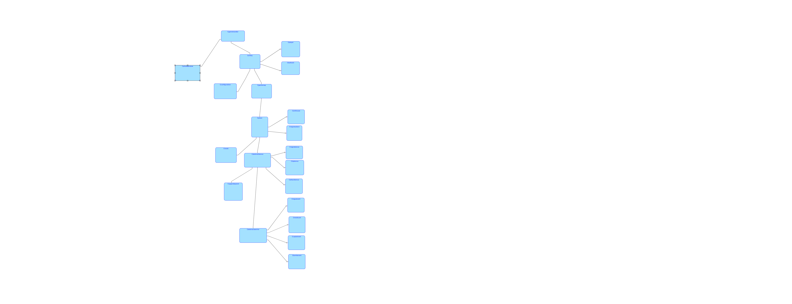

# Overview

This project is an implementation of the game "Ant Wars". The objective is to capture all anthills on the map by dispatching armies from your own anthills to enemy ones. If an expedition successfully defeats the defending garrison, the player takes control of the anthill.

Players can upgrade their ants in multiple ways. They can choose to globally increase the attack or health of all their existing ants. Once both of these basic upgrades have been used at least three times, players unlock the ability to upgrade their ants' range. Alternatively, players can promote individual ants within their anthills to specialized roles: Captain, Medic, or Demolitionist. The Captain boosts the attack of allies in range, the Medic restores their health, and the Demolitionist eliminates all enemy ants in range upon dying.

The game is highly customizable. It loads a configuration file that determines the base range, health, and attack of the ants, as well as the scaling impact of upgrades, along with the game map. Players can also save their ongoing games. Upon launching the game, the player can choose to resume a saved session or start a new one using either default or custom maps and configurations.

## Polymorphism

Polymorphism is heavily utilized in the implementation of the ants. There is a core abstract class that handles common statistics and functionalities, such as taking damage or checking if the ant is still alive. This base class is inherited by all specific ant types (Medic, Captain, Demolitionist, and Regular), with the Regular ant implementing an additional promoteAnt method.

Polymorphism is also applied to the upgrade system, where all bonuses inherit from an abstract bonus class and override the behavior of the aplicateUpgrade method. Furthermore, it is used in the representation of the game map: both regular tiles and anthills inherit from a common CPlace class, which stores coordinates. The anthill subclass introduces additional logic to store an array of ants and manage the statistics of the ants generated within it.
### Example game

	################################
	#@@@@@      &&&&&              #
	#@d00@rrrrrr&g41&              #
	#@@@@@      &&&&&              #
	#          rr==  @@@@@         #
	#          r##===@h00@  #      #
	#          r##   @@@@@###      #
	#     &&&&&r%%%%%rrr###        #
	#     &y50&r%B91%r  #          #
	#     &&&&& %%%%%   #          #
	################################
	
	#####################
	#@@@@@      &&&&&   #
	#@d07@      &g45&   #
	#@@@@@      &&&&&   #
	#           ##      #
	#           ##      #
	#           ##      #
	#           %%%%%   #
	#           %B72%   #
	#           %%%%%   #
	#####################

### Controls
enter to continue cycle\n
XaY -attack from X to Y\n
up-a -upgrade attack\n
up-h -upgrade health\n
up-r -upgrade range\n
promXc -promote first ant in X to captain\n
promXb -promote first ant in X to bomber\n
promXm -promote first ant in X to medic\n
save -save game\n
exit -exit\n

### Class diagram

